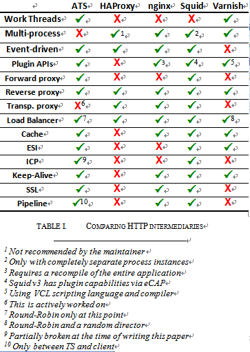
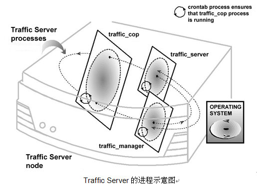
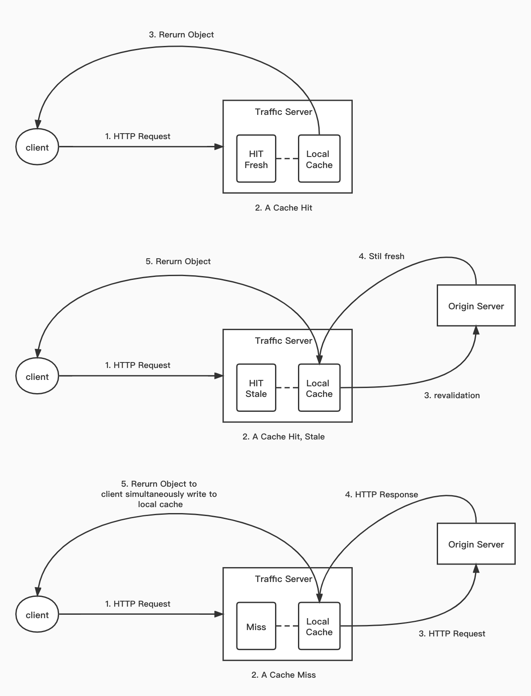

<!-- toc -->

[TOC]

# ATS概述

对于软件开发从业人员来说，你如果问他熟悉哪些web服务器，恐怕多数人都会快速回答出Nginx、Apache，不过要是提到ATS，可能很多人都是少有耳闻。那么我们先介绍下什么是ATS。

`Apache Traffic Server` 简称ATS或者TS，它是一个高性能、模块化的HTTP代理和缓存服务器，这里描述了它的两个重要功能，其一是web代理服务器（正向代理、反向代理），另外一个核心功能就是缓存服务器。
Traffic Server 最初是 Inktomi 公司的商业产品，该公司在 2003 年被 Yahoo 收购，之后 Traffic Server 一直在 Yahoo 内部使用，此时它被称作 `YTS`，直到 2009 年 8 月 Yahoo 向 Apache 软件基金会贡献了源代码，并被改名为ATS。

> 这里插入一个关于ATS的小故事。2013年，雅虎收购了inktomi，当时公司已经彻底把ATS相关产品、代码、资料、人员全部裁掉了，资产接手工程师发现在某个角落有个机器，好多土，就问问这机器干嘛的，然后某个还在公司的老员工介绍了一下，雅虎的人还挺实在，就开机看看，发现机器是一个开发测试机器，机器里的系统还能跑，里面有一些不太齐全的代码，然后测试了一下程序，看性能比squid应该好，就把代码入库到雅虎的cvs，cvs tag名字：ts-gold。代码checkin时间，2003年6月20号左右，这就是当年的yts-1.4= i ts-1.4，是ATS的祖宗。后来，ATS发展到09年，1.17版本，砍掉50%代码后，开源出来的yts1.17就是ATS2.0版本。完全是垃圾堆捡回来的，只有一个临时的像是开发测试export出来的代码，没cvs历史，没文档。据猜测，这个机器是因为放角落，不显眼所以没被烧掉，其他能烧的都烧了。

针对于市面上存在的开源的缓存服务器，主要有：

- Squid： 国内最早的被CDN厂商大范围应用的缓存服务器，单进程模型，无法利用多核优势，逐步被取代
- Varnish： 支持多核，纯内存缓存，所以可缓存的内容会受到总内存大小的限制，适用的场景有限。
- Nginx： 通过proxy插件支持了缓存功能，对于一些简单的场景比较适用，但是对于CDN的各种静态服务场景的下载，支持度不够。
- ATS： 支持多核，应用多级缓存进行加速，可通过插件进行开发，插拔方便，针对各种下载缓存相关的业务场景都有很好的支持。

具体的功能对比，这里我偷个懒，从网上拿到了一个对比图，如下： 



## 业界各CDN厂家使用情况

- 网宿：对于历史的老业务，使用Squid，新业务迁移到ATS。
- 小米、京东等主要使用ATS
- 腾讯：自研缓存
- 百度：nginx + 自研缓存
- 阿里：tengine + 基于squid和ats的设计，自研swift。
- 又拍云：2013年之前用squid，2013-2017年使用ATS，2017年后开始使用自研的BearCache。（ https://g.126.fm/03Ff13S ）


## ATS组件

Traffic Server 由若干一起工作的组件来组成一个便于监控和配置的 web 代理缓存。在逻辑上，它主要由下面几个部分组成：

### 1. Traffic Server缓存管理

 - TS 缓存包含一个高速的对象数据库，被称之为 `object store`，对象数据库根据 URL 和相关头部来索引对象，对于同一对象可以缓存不同版本（如不同的编码、语言、压缩格式等）。
 - 对缓存空间的高利用率。当缓存空间满后，TS 会移除过期的数据对象。
 - 对磁盘的高容错性。当单块磁盘出错时，TS 将不再使用该块磁盘，转而使用剩下的磁盘。所有磁盘都出错时，TS 将切换至 proxy-only 模式，即只代理，不缓存。
 - 可定制化分区，即可以给指定的协议和源服务器划分一定数量的磁盘空间

### 2. RAM 缓存

内存缓存区储存比较热门的对象，在流量的高峰期时能加快处理速度和降低磁盘负载。

### 3. 主机数据库(HostDB)

HostDB 负责存储连接的源服务器 DNS 记录。主要包含如下：

- 储存 DNS 信息，方便主机名到 IP 地址的快速转换
- 储存每个主机的 HTTP 版本，方便高级协议特性的使用
- 储存源服务器的可靠性和可用性状态信息，从而方便TS进行回源的故障转移。

### 4. DNS 解析器

TS 原生实现了 DNS 解析器，可并发异步查询，不依赖较慢的传统解析库。同时，由于HostDB的存在，相当于在LocalDNS前又做了一层DNS缓存，降低了 DNS 的流量。

### 5. Traffic Server 进程
    
ATS在5.x ~ 7.x的版本，主要由`traffic_cop`, `traffic_manager`, `traffic_server`三个进程组成。三个进程的功能如下：

- traffic_cop 进程监视 traffic_server 和 traffic_manager 进程，traffic_cop 会周期性的查询 traffic_server 和 traffic_manager 进程的健康状况，如果查询在一定间隔时间内未返回或者返回信息不正确，traffic_cop 将重启 traffic_manager 和 traffic_server 进程。 traffic_cop 是相对独立的进程，它属于旁路监控，所以即便将traffic_cop进程kill掉，也不会影响到traffic_server 和 traffic_manager对正常HTTP业务的处理。
- traffic_manager ， 顾名思义，是 traffic_server 进程的控制进程，它负责拉起、监控和配置 traffic_server 进程，它也负责代理的端口配置和监听、统计信息的接口、集群管理和虚拟 IP 的故障转移。 如果 traffic_manager 检测到 traffic_server 进程失效，或者检测到 traffic_server内存占用过高等情况，它会重启 traffic_server 进程，并且维护一个连接队列，保存此时到来的请求，完全重启后这个队列里的连接将按顺序被处理。
- traffic_server 进程负责接受连接，处理HTTP请求，然后从缓存或源服务器获取对象并返回。ATS的这种traffic_manager + traffic_server的设计，与nginx的master + worker的模式比较像，可以类比学习。



小Tips： traffic_cop 进程是没有得到高可用的保证的，所以，在部署ATS7.x时，建议在系统中开一个crontab，定时检查traffic_cop进程的可用性，确保ATS旁路的健康检查服务traffic_cop一直存在。

其实，traffic_cop 存在一些弊病，比如有些时候它会认为traffic_server不健康而自动触发重启ATS的服务，而且，它本身也没有保证高可用，需要额外的一个进程对traffic_cop来定期监控，所以，在ATS8.x中，将traffic_cop进程移除。https://github.com/apache/trafficserver/pull/3609 。建议直接用外部服务对traffic_manager进行健康检查即可。

### 6. 管理工具

1. traffic_ctl： 这是TS最常被使用的管理工具，主要包含 `配置热更新`, `监控指标管理`, `traffic_server 进程管理`, `存储管理`等功能。
2. traffic_server： traffic server进程的启动入口，同时，也支持TS的`配置检查`、`缓存清理（磁盘、DNS）`等功能。
3. traffic_via ( https://trafficserver.apache.org/tools/via )， TS会在HTTP响应头的`via`头中定义一系列缓存相关的字段，如`[cRs f ]`，对于没有深入了解TS的使用者来说，需要借助该工具查询相关字段代表的含义。
4. traffic_top： TS的实时监控工具，包含缓存命中率、内存使用率、磁盘使用率、DNS缓存相关数据等等。
5. traffic_cache_tool： 由于TS使用的是裸盘，意味着不会使用文件系统，自然也没有文件的概念，TS在访问磁盘时，会使用`O_DIRECT`替代。因此对于TS的缓存管理，可以利用该工具，检查对磁盘中缓存对象的检查。


## Traffic Server 的底层机制

Traffic Server 设计的思想是将一个大系统划分为若干个小的子系统，每个子系统负责专门的任务或应用，从底层实现上看，TS 8.X主要分为以下6个子系统（TS8.x以前的版本还包括对ICP、cluster等的支持）：

1. Event 子系统负责提供任务事件的调度服务、buffer管理等。
2. Net 子系统负责提供网络服务，定义了网络处理的基础框架。
3. AIO 子系统负责异步事件处理，实现了类似于libc的AIO线程方案。
4. Cache 子系统负责缓存与文件系统，管理磁盘存储、内存cache等核心功能
5. HostDB 子系统负责缓存回源服务的DNS信息，相当于在LDNS之上又加了一层缓存。
6. DNS 子系统负责构造DNS请求与解析DNS应答。

每个子系统被抽象为一个 `Processor`，这种高内聚低耦合的设计原则使系统具有更好的重用性，维护性和扩展性。例如，如果 `hostDBProcessor` 需要进行 DNS 解析，可以直接调用 `dnsProcessor` 的相关函数，而无需关注 DNS 解析的细节；`dnsProcessor` 也只需封装 DNS 请求和解析 DNS 应答，和网络相关的功能可以调用 `netProcessor` 来完成。

Traffic Server的超高并发依赖于两个技术的实现，即 `异步事件处理` 和 `多线程`，TS底层大量基于异步，但向上提供的并发却大量基于协程的概念，TS实现了一套协程Continuation，结构体用`TSCont`表示，Continuation是整个异步回调机制的多线程事件编程基础，是一个最最基础的抽象结构，后续的所有高级结构，如Action Event VC等都封装Continuation数据结构。因此，TS在多CPU、多核的硬件上扩展良好，能充分利用所有可用的 CPU 和其他系统资源。

## TS源码目录结构

ATS8.x以后，代码被管理的还是比较规范的，下面以ATS8.1.x为例，列出ATS的源码目录结构以及用途：

```
|-- trafficserver
  |-- build/ ................ 基于M4的宏定义，用于configure.ac
  |-- ci/ ................... CI工具以及一些相关配置
  |-- contrib/ .............. 一些第三方贡献的辅助工具
  |-- doc/ .................. TS文档
  |-- iocore/ ............... TS的核心子系统的底层实现
      |-- aio/ .............. 异步IO
      |-- cache/ ............ 磁盘、内存缓存
      |-- eventsystem/ ...... 事件驱动
      |-- dns/ .............. 异步DNS查询器、解析器
      |-- hostdb/ ........... DNS缓存
      |-- net/ .............. 网络
      |-- utils/ ............ Utilities
  |-- include/
      |-- ts ................ 封装的用于插件开发的 C API 的头文件
      |-- tscpp ............. 封装的用于插件开发的 C++ API 的头文件
      |-- tscore ............ traffic_server 和 traffic_manager进程依赖的头文件
      |-- wccp .............. 网页缓存通信协议(Web Cache Communication Protocol)的实现
  |-- lib/ ..................
      |-- perl/ ............. Perl libraries for e.g. mgmt access and configurations
      |-- records/ .......... Library for config files
      |-- tsconfig/.......... New config parser and library (experimental)
      |-- yamlcpp/ .......... Library for YAML of C++
  |-- mgmt/ ................. Management server and tools
  |-- plugins/ .............. 稳定的核心插件，可在生产环境中使用的
      |-- experimental/ ..... 尚处于实验性的插件
  |-- proxy/ ................ HTTP 代理的核心逻辑
      |-- hdrs/ ............. http头的解析与管理
      |-- http/ ............. 核心的http事件处理机制，包括http状态机的定义等
      |---http2/ ............ HTTP/2 的实现
      |-- logging/ .......... 日志相关
      |-- shared/ ........... Shared files
  |-- rc/ ................... Installation programs and scripts
  |-- src/ .................. Source for all the main binaries / applications
      |-- traffic_cache_tool/ TS缓存查询交互工具
      |-- traffic_crashlog/ . TS异常分析工具
      |-- traffic_ctl/ ...... 主要的命令行管理工具
      |-- traffic_layout/ ... Display information on the build and runtime directory structure
      |-- traffic_logcat/ ... Convert binary log file to plain text
      |-- traffic_logstats/ . Log parsing and metrics calculation utility
      |-- traffic_manager/ .. traffic_manager进程启动入口
      |-- traffic_server/ ... traffic_server进程启动入口
      |-- traffic_top/ ...... TS监控数据查询工具
      |-- traffic_via/ ...... TS via缓存头查询工具
      |-- traffic_wccp/ ..... Program speaking the client side of the WCCP
  |-- tests/ ................ Different tests for Traffic Server
  |-- tools/ ................ Directory of various tools
  |-- INSTALL ............... Build and installation guide
  |-- LAYOUT ................ Traffic Server default layout
  |-- LICENSE ............... Full license text
  |-- NOTICE ................ Copyright notices
  |-- README ................ Intro, links, build info
  |-- README-EC2 ............ Info on EC2 support
  |-- REVIEWERS ............. (Incomplete) list of areas with committer interest
  `-- STATUS ................ Release history and information
```

## HTTP 代理缓存机制

### 从一个http请求说起

Traffic Server 处理HTTP请求，分为如下三种情况：



1. 本地缓存命中，缓存未过期
2. 本地缓存命中，缓存过期
3. 本地缓存未命中


- 用户发起一个http请求，TS 收到请求后，会将http请求中的url视为一个web缓存对象
- TS 通过对象的地址，在本地缓存中去检索该对象
   - 如果对象在本地缓存中，TS 会检查对象是否新鲜（fresh）
      - 如果新鲜，TS 从本地缓存中直接返回该对象给用户，此时称为缓存命中（cache hit）
      - 如果不新鲜（stale），TS 会连接源服务器去验证对象是否仍然新鲜，即重新验证（revalidation），如果仍然新鲜，TS 立即将缓存中的对象副本返回给用户，并更新本地对象的新鲜状态。
   - 如果对象不在本地缓存中（缓存未命中，cache miss），或者缓存的过期对象已经不再有效，TS 会去源服务器发起HTTP请求获取对象，然后同时做下面两件事:
      - 将对象返回给用户
      - 将对象放到本地缓存中

### ATS如何计算新鲜度

Traffic Server 检查 HTTP 对象是否新鲜，按照如下优先级判断

- 如果有 `Expires` 或者 `Cache-Control: max-age=xxx` 头部直接定义缓存的过期时间，TS将对比当前时间和过期时间去判断对象是否新鲜
- 如果没有上述头部，TS 将检查 `Last-Modified` 和 `Date` 头部（其中Date是源服务器返回对象的时间，如果没有`Last-Modified` 头部，TS 会用对象写入缓存的时间以作代替），然后用以下公式算出新鲜的时间范围（freshness_limit，可理解为保质期）:
    ```
    freshness_limit = ( Date - Last-Modified ) x 0.1
    ```
  0.1 这个参数可以作调整，写在ats的records.config 中，由配置条目`proxy.config.http.cache.heuristic_lm_factor`定义，并且能限制 freshness_limit 的上下限，默认最小是 1 小时（`proxy.config.http.cache.heuristic_min_lifetime`），最大是 1 天(`proxy.config.http.cache.heuristic_max_lifetime`)
- 如果没有 `Expires` 头部或者没有 `Last-Modified`、`Date` 头部，TS 将使用默认的计算出的 `fressness limit`作为缓存时间。
- 此外，TS 为特定的业务需求留有后门，即 `cache.config` 配置文件，在该文件中可以定义多种缓存规则，优先级可以凌驾于以上规则。例如可以对特定的 HTTP 对象（如特定的域名、IP、一定规则的 URL、特定的客户端等等）设置缓存时间或revalidate时间.
